# facebook_app
 
## Introduction
For this project, we have created an application which allows the user to upload images from Facebook for search and get suggestions by using a tool called the Graph API. After the Images are uploaded the images are sent to Google Cloud Vision to analyze the uploaded images dn return the labels for the images and these labels are used for searching the images. The uploaded images are stored in Google Datastore. The searched images can be shared on facebook.

## Application Link: https://fbapp-348423.uc.r.appspot.com/
## Youtube Link: https://youtu.be/WEI3tWHLTWw

## Table of contents:
### Proposal
### Description
### Demonstration of Application working
### GAE Issues and GAE Datastore
### Java Code Documentation

### Analytics Project 1 Proposal

#

## Proposal:

Using Facebook Photos API and Google Cloud Storage and Computer Vision API's to detect objects in an image and creating clusters of objects for classification of images.

The application will retrieve a Facebook photo from the user’s Facebook profile using Graph API and use the retrieved photo for processing results through Google SaaS Computer Vision API .
The result then will be used for Google Analytics Platform (App Engine Server Side Analytics) as it provides computing resources to collect, store, process, and report on these user-interactions to detect objects and start creating clusters of the object based on the similarity of the object to the reference object for image classification.

The application will be able to access the photos of users on his/her Facebook profile using the Facebook Graph API which is the primary way for the application to read and write to the Facebook Social Graph then the photos will be stored in Google DataStore. The Google VisionAI will be used to extrapolate data from photos to detect the objects and will return appropriate labels with respect to the image. Image object detection information will be used to classify the image. After extrapolation we will store the extrapolated data on the Google DataStore to fetch instantaneous data when called again in future and for further data analytics and exploration.
#
## Description:
### Results.java: 
In this class, the url and id of facebook images are fetched from the index.jsp page and then the images are sent to google cloud vision to get the labels if the image is not already present in Google Data Store. After the labels are fetched the label, id and url are added to Google Data Store and it page redirects to labels.jsp
### Search.java:
This class has a search label as input which is used to fetch images that have the same label. It fetches its url and then passes it on to output.jsp
### Upload.java:
This class will display all the images that are being fetched and it directs to output.jsp which has the function to upload the image and share it on Facebook.

#
## Demonstration of Application working
### Homepage
This is our hoepage
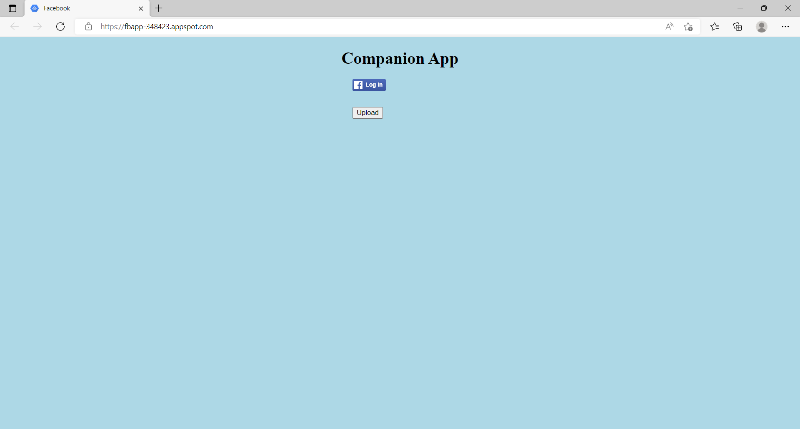

### Facebook Logged In
Confirmation message is received once you have been successfully logged in to the server
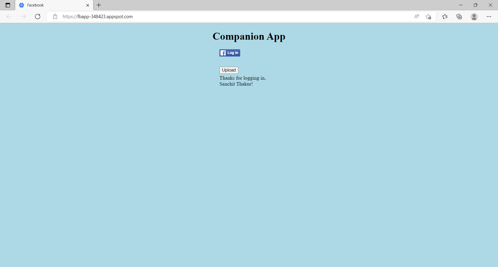

### Search Bar 
To search the image tags for relevant image 

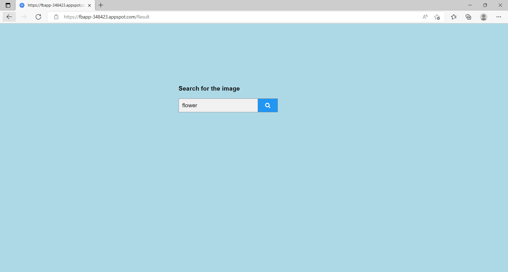
### Image retrieved by the keyword
Image that is fetched from the datastore by the keyword though which you're trying to search the image
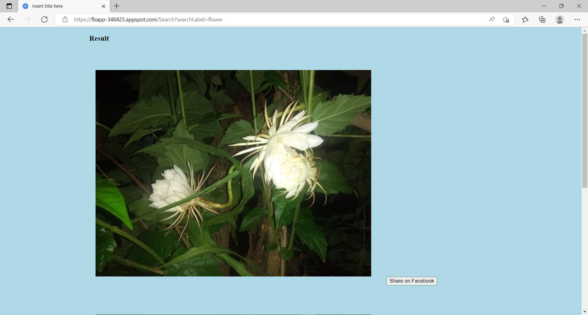

### Post image on Facebook
Image can be posted on the face through the share button
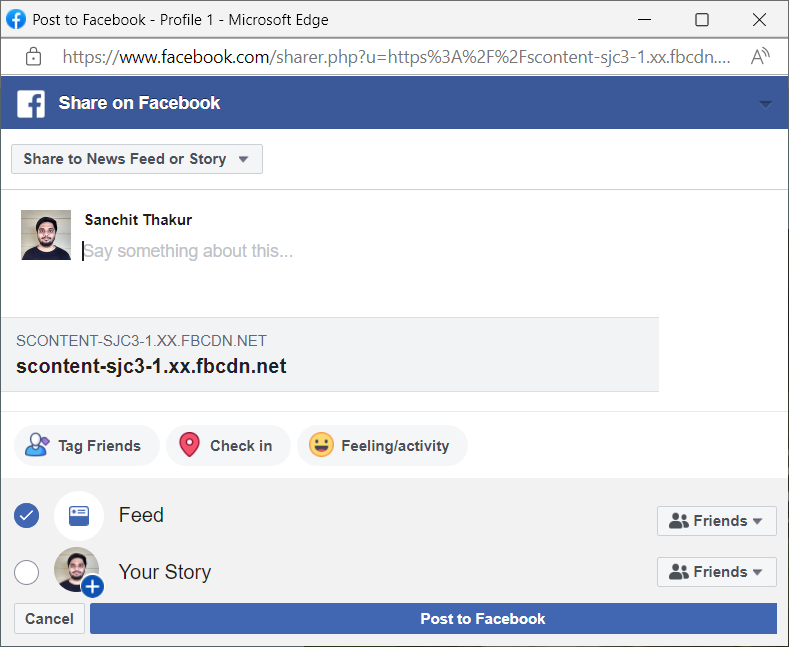

### Shared image on Facebook
Example of the posted image on Facebook
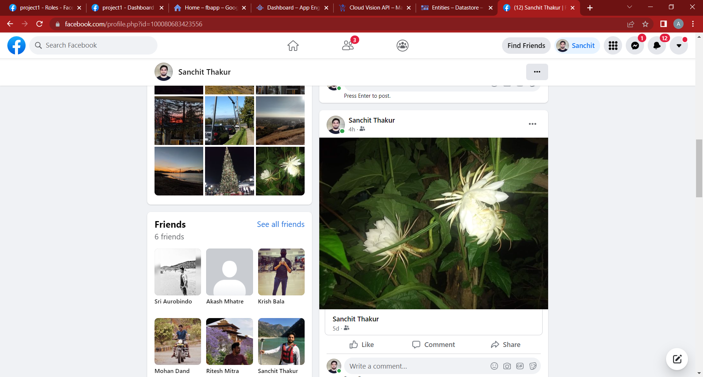

### Facebook Project
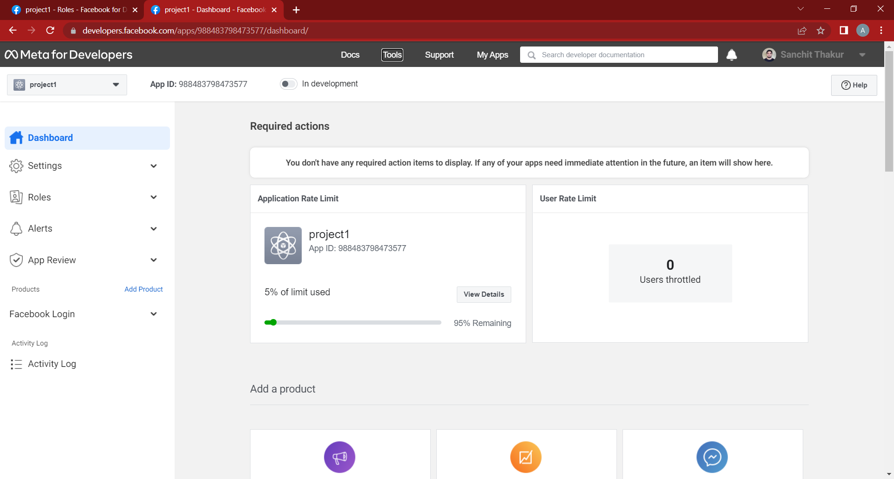
#
## GAE Issues and GAE Datastore
#
### Issues faced:
We were unable to use multiple labels for searching the image.
example when we tried search for car and bike in the same image the application was crashing.

### Google Project
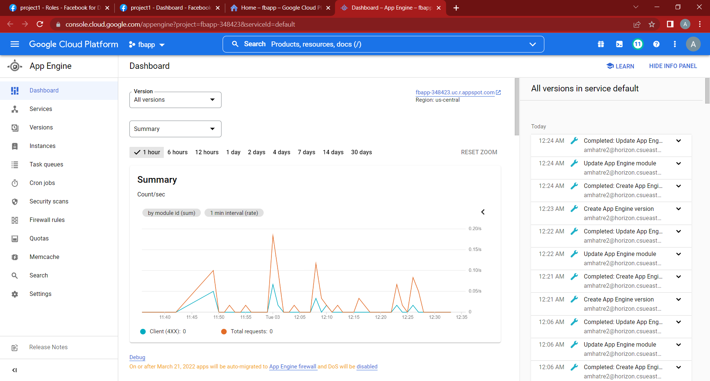
### Image on Google Datastore
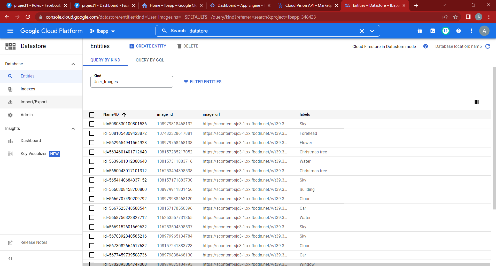
### Google app engine activity
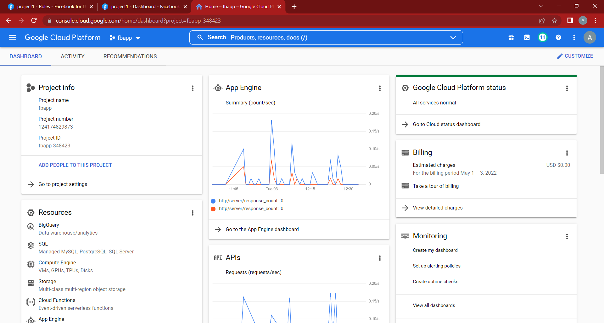
### Gooogle Cloud Vision
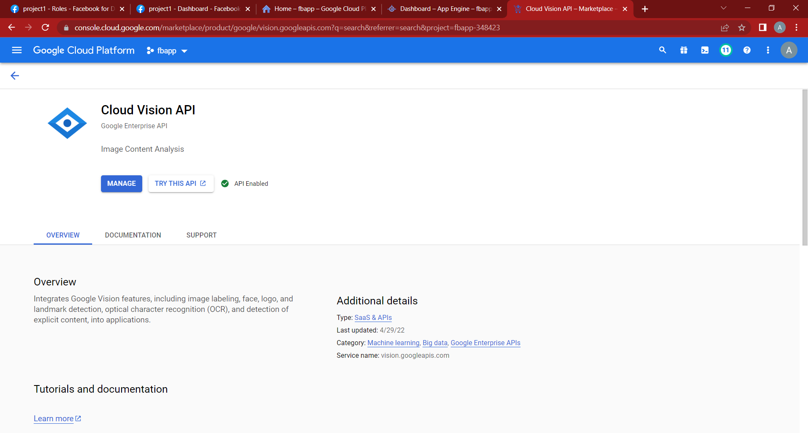

#
## Java Code Documentation
#

#
## Analytics Project 1 Proposal
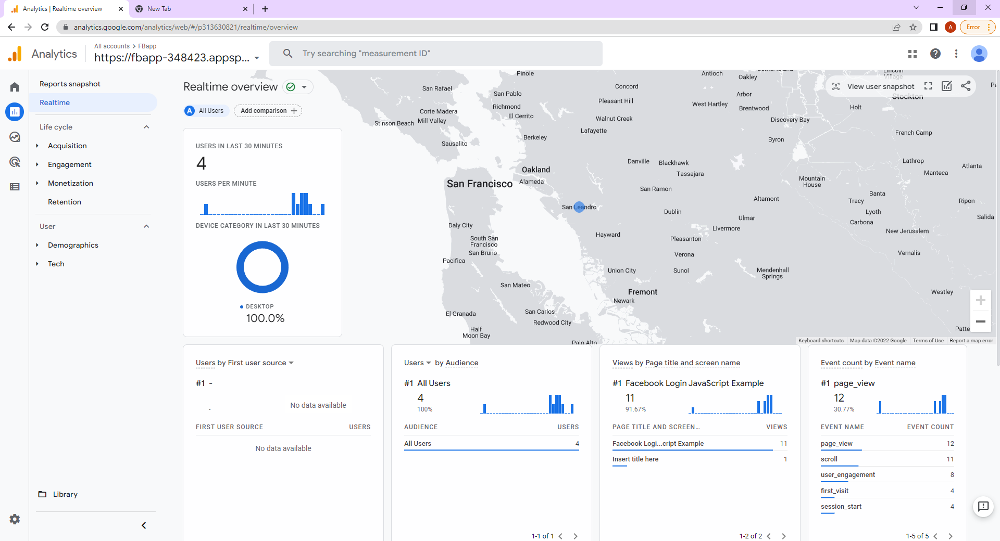

